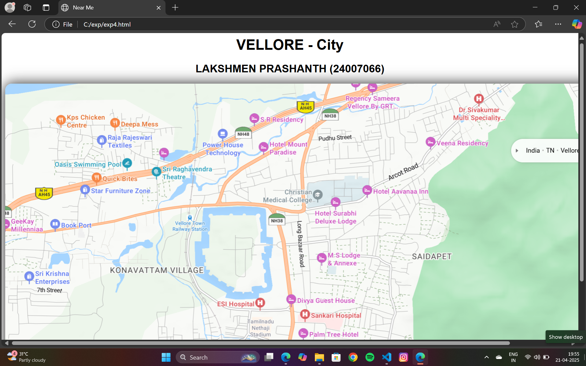

# Ex04 Places Around Me
## Date: 22/04/2025

## AIM
To develop a website to display details about the places around my house.

## DESIGN STEPS

### STEP 1
Create a Django admin interface.

### STEP 2
Download your city map from Google.

### STEP 3
Using ```<map>``` tag name the map.

### STEP 4
Create clickable regions in the image using ```<area>``` tag.

### STEP 5
Write HTML programs for all the regions identified.

### STEP 6
Execute the programs and publish them.

## CODE
## Near Me

```html
<html>
    <head>
        <title>Near Me</title>
        <style>
			body {
				font-family: arial;
                align-items: center;
			}
            .mapimg {
                border-radius: 15px;
                box-shadow: 0px 0px 30px rgb(32, 32, 32);
                width: 1433px;
            }
        </style>
    </head>
    <body>
		<h1 align = "center">VELLORE - City</h1>
        <h2 align = "center">LAKSHMEN PRASHANTH  (24007066)</h2>
        <center></center>
        <map name="landmarks">
            <!-- Image Map Generated by http://www.image-map.net/ -->


<map name="image-map">
    <area target="_blank" alt="S R residency" title="S R residency" href="srresidency.html" coords="702,72,910,137" shape="rect">
    <area target="_blank" alt="ESI hospital" title="ESI hospital" href="Esi.html" coords="697,653,157" shape="circle">
    <area target="_blank" alt="Naveen pain" title="Naveen pain" href="naveenpain.htmlb" coords="234,850,222,778,289,753,363,779,392,836,323,858,298,877" shape="poly">
    <area target="_blank" alt="Book port" title="Book port" href="bookport.html" coords="127,392,259,443" shape="rect">
    <area target="_blank" alt="Sri Raghavendra Theatre" title="Sri Raghavendra Theatre" href="theater.html" coords="507,265,166" shape="circle">
</map>
    </body>
</html>
```
## SR-RESIDENCY
```html
<html>
    <head>
        <title>SR-RESIDENCY</title>
        <style>
            body {
                background-color: #37a41e;
                font-family: arial;
                text-align: center;
                color: #ffffff;
                line-height: 47px;
                font-size: 30px
            }
            h1 {
                margin-top: 30px;
            }
            p {
                margin-top: 30px;
                width: 80%;
            }

            .content {
                margin: 100px;
            }
        </style>
    </head>
    <body>
        <h1>SR-RESIDENCY</h1>
        <hr color="#ffffff" size="7px">
        <p class="content">It is a great resting place with family and friends to stay. It is a good place to stay for a day or two. The rooms are clean and well maintained. The staff is very friendly and helpful. The food is also good and the prices are reasonable. The location is also very convenient as it is close to many tourist attractions and shopping areas.
            <br>
            People mostly prefers buying here for their convinience.
        </p>
    </body>
</html>
```
## ESI-HOSPITAL
```html
<html>
    <head>
        <title>ESI-HOSPITAL</title>
        <style>
            body {
                background-color: #0764b5;
                font-family: arial;
                text-align: center;
                color: #ffffff;
                line-height: 47px;
                font-size: 30px
            }
            h1 {
                margin-top: 30px;
            }
            p {
                margin-top: 30px;
            }
            .content {
                margin: 100px;
            }
        </style>
    </head>
    <body>
        <h1>ESI-HOSPITAL</h1>
        <hr color="#ffffff" size="7px">
        <p class="content">ESI-HOSPITAL, located in vellore, is a well-known healthcare institution that provides comprehensive medical services to employees and their families. The hospital is equipped with modern facilities and a team of experienced doctors and healthcare professionals. It offers a wide range of services, including outpatient care, inpatient care, emergency services, and specialized treatments. The hospital is committed to providing quality healthcare at affordable prices, making it accessible to a large population. The staff is dedicated to ensuring patient comfort and satisfaction, and the hospital maintains high standards of hygiene and safety.
            <br>
            ESI-HOSPITAL is a trusted name in the community, known for its commitment to excellence in healthcare. It plays a vital role in promoting the health and well-being of employees and their families, making it an essential part of the healthcare landscape in Vellore.
        </p>
    </body>
</html>
```
## Naveen paint 
```html
<html>
    <head>
        <title>Naveen paint</title>
        <style>
            body {
                background-color: #ffe600;
                font-family: arial;
                text-align: center;
                color: #000000;
                line-height: 47px;
                font-size: 30px
            }
            .title {
                margin-top: 30px;
                font-size: 60px;
                font-weight: bolder;
            }
            p {
                margin-top: 30px;
            }

            .content {
                margin: 100px;
            }

            .s {
                color: #000000;
            }
        </style>
    </head>
    <body>
        <p class="title">Naveen paint <span class="s">Dolby</span> Atmos</h1>
        <hr color="#000000" size="7px">
        <p class="content">KSPS Ganapathy Kalaiarangam, located in vellore, is an popular paint shop that offers a wide range of high-quality paints and coatings for various applications. The shop is known for its extensive selection of colors, finishes, and brands, catering to both residential and commercial customers. The knowledgeable staff provides expert advice on paint selection, application techniques, and color matching, ensuring that customers find the perfect products for their projects.
            <br>
            The shop also offers additional services such as color mixing, custom tinting, and paint accessories, making it a one-stop destination for all painting needs. With a commitment to customer satisfaction and a focus on quality, KSPS Ganapathy Kalaiarangam is a trusted name in the local paint industry. Whether you're a DIY enthusiast or a professional painter, this shop provides the tools and expertise needed to achieve stunning results in any painting project.
        </p>
    </body>
</html>
```
## Book port
```html
<html>
    <head>
        <title>Book port</title>
        <style>
            body {
                background-color: #ab3c1a;
                font-family: arial;
                text-align: center;
                color: #edcd16;
                line-height: 47px;
                font-size: 30px
            }
            h1 {
                margin-top: 30px;
            }
            p {
                margin-top: 30px;
            }
            .content {
                margin: 100px;
            }
        </style>
    </head>
    <body>
        <h1>Book port</h1>
        <hr color="#edcd16" size="7px">
        <p class="content">The newly renovated Book port near Anna bus stand in Vellore is a vibrant and bustling hub for book lovers and students alike. With its modern design and spacious layout, the bookstore offers a wide range of books, stationery, and study materials to cater to the needs of the local community. The store features comfortable reading areas, making it an ideal spot for students to study or relax with a good book. The friendly staff is always ready to assist customers in finding their desired titles or recommending new reads. Book port also hosts regular events, such as book signings and author talks, fostering a sense of community among literature enthusiasts. 
            <br>
            It is a great place to buy books and other stationary items. It is very close to the bus stand which makes it easy for people to buy things from here. It is a good place to buy books at reasonable prices.
            <br>
            It is a great place to buy books and other stationary items. It is very close to the bus stand which makes it easy for people to buy things from here. It is a good place to buy books at reasonable prices.
        </p>
    </body>
</html>
```
## Sri Raghavendra Theatre
```html
<html>
    <head>
        <title>Sri Raghavendra Theatre</title>
        <style>
            body {
                background-color: #470a92;
                font-family: arial;
                text-align: center;
                color: #000000;
                line-height: 47px;
                font-size: 30px
            }
            h1 {
                margin-top: 30px;
            }
            p {
                margin-top: 30px;
            }
            .content {
                margin: 100px;
            }
        </style>
    </head>
    <body>
        <h1>Sri Raghavendra Theatre</h1>
        <hr color="#000000" size="7px">
        <p class="content">Sri Raghavendra Theatre in vellore is a popular cinema hall that offers a delightful movie-watching experience. Known for its comfortable seating and excellent sound quality, the theatre attracts a diverse audience. It screens a variety of films, including the latest releases in Tamil, Telugu, and Hindi, catering to the tastes of local moviegoers. The theatre is equipped with modern amenities, ensuring a pleasant environment for viewers. The staff is friendly and attentive, enhancing the overall experience. Sri Raghavendra Theatre is not just a place to watch movies; it is a hub for entertainment and social gatherings in the community.
            <br>
            The theatre is well-maintained and provides a clean and hygienic environment for its patrons. It also offers a range of snacks and beverages, making it a complete entertainment package. With its convenient location and affordable ticket prices, Sri Raghavendra Theatre is a favorite destination for families, friends, and movie enthusiasts in Vellore. Whether you're looking for the latest blockbuster or a classic film, this theatre has something for everyone.
        </p>
    </body>
</html>
```


## OUTPUT




## RESULT
The program for implementing image maps using HTML is executed successfully.
